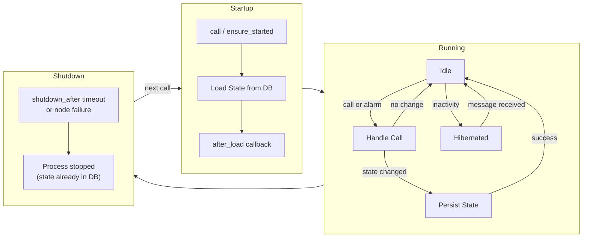
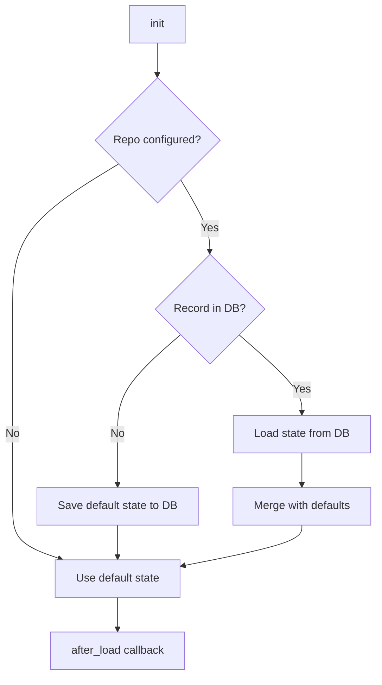
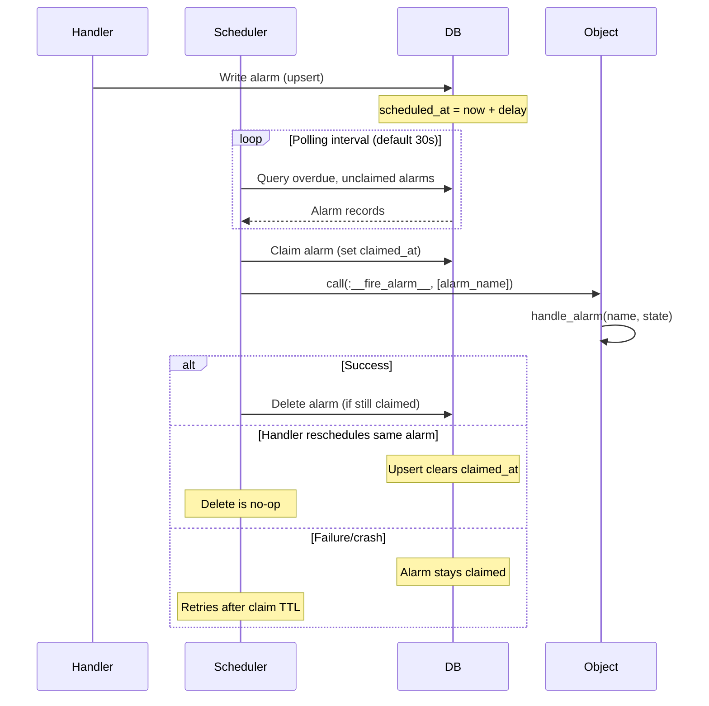

# Durable Object Lifecycle

This guide describes the complete lifecycle of a durable object, from startup through execution, hibernation, and shutdown.

## Overview



## Phases

### 1. Starting

A durable object process is started on demand when you call it:

```elixir
MyApp.Counter.increment("user:123", 1)
# or
DurableObject.call(MyApp.Counter, "user:123", :increment, [1])
```

The system checks if a process for the `(module, object_id)` pair is already running. If not, a new process is started under a `DynamicSupervisor` with a `:temporary` restart strategy -- meaning it will not be automatically restarted if it stops.

In distributed mode (Horde), the registry ensures only one process exists for a given `(module, object_id)` across the entire cluster.

### 2. Loading State



During `init/1`, the server loads persisted state from the database. If no record exists yet, the default state (derived from field definitions in the DSL) is saved. Loaded state is merged with defaults so that newly added fields get their default values.

### 3. After Load

The optional `after_load/1` callback runs once after state is loaded. This is useful for scheduling initial alarms or performing one-time setup:

```elixir
def after_load(state) do
  {:ok, state, {:schedule_alarm, :cleanup, :timer.minutes(30)}}
end
```

If `after_load` modifies state, the new state is persisted before the object begins accepting calls.

### 4. Handling Calls

When a call arrives, the server invokes the corresponding `handle_<name>/N` function. Handlers return a result tuple:

```elixir
def handle_increment(amount, state) do
  new_count = state.count + amount
  {:reply, new_count, %{state | count: new_count}}
end
```

**State persistence is transactional.** If the state changed, it is written to the database. If the write fails, the state is rolled back to its previous value and the caller receives an error. This guarantees that in-memory state and database state stay in sync.

Handlers can also schedule alarms as part of their return value:

```elixir
{:reply, :ok, new_state, {:schedule_alarm, :expire, :timer.hours(1)}}
```

### 5. Alarms



Alarms are persisted in the `durable_object_alarms` table and survive process restarts. The polling scheduler uses **claim-based execution** for crash recovery:

1. **Claim**: Before firing, the scheduler atomically sets `claimed_at` on the alarm
2. **Fire**: The object's `handle_alarm/2` callback is invoked
3. **Delete**: On success, the alarm is deleted only if still claimed

If a handler reschedules the same alarm, the upsert clears `claimed_at`, so the delete becomes a no-op and the new alarm persists. If the handler fails or the server crashes, the alarm remains claimed and will be retried after the `claim_ttl` expires (default: 60 seconds).

Alarms with the same `(object_type, object_id, alarm_name)` are upserted, so scheduling an alarm that already exists replaces it.

### 6. Hibernation

After a configurable period of inactivity (default: 5 minutes), the GenServer hibernates automatically. This reduces memory usage to a minimum while keeping the process alive and registered. The next incoming message wakes the process transparently.

Configure via the DSL:

```elixir
options do
  hibernate_after :timer.minutes(10)
end
```

### 7. Shutdown

Optionally, objects can shut down entirely after extended inactivity. Unlike hibernation, shutdown terminates the process. The next call will re-start the object from the database.

```elixir
options do
  shutdown_after :timer.hours(1)
end
```

The shutdown timer resets on every handler call, so only truly idle objects are stopped. State is already persisted (it was saved after the last handler call), so no data is lost.

### 8. Recovery

Because state is persisted after every mutation and alarms are stored in the database, recovery is automatic:

- **Process crash**: The next call starts a fresh process that loads state from the database. Alarms continue to fire since they are tracked externally.
- **Node failure (Horde)**: Horde detects the failure and the object is re-started on another node on the next access. The polling scheduler also runs as a cluster singleton and migrates automatically.
- **Application restart**: All objects start on demand. Pending alarms are picked up by the scheduler once it starts polling.
- **Crash during alarm handler**: If the server crashes while executing an alarm handler, the alarm remains in the database with its `claimed_at` timestamp. After the `claim_ttl` expires (default: 60 seconds), the alarm becomes available for retry.

#### At-Least-Once Semantics

The polling scheduler provides **at-least-once delivery** for alarms. An alarm may fire more than once if:

- The handler completes but the process crashes before deletion
- The `claim_ttl` expires and another poller retries a still-processing alarm

Design your `handle_alarm/2` callbacks to be **idempotent** -- safe to execute multiple times with the same effect.
